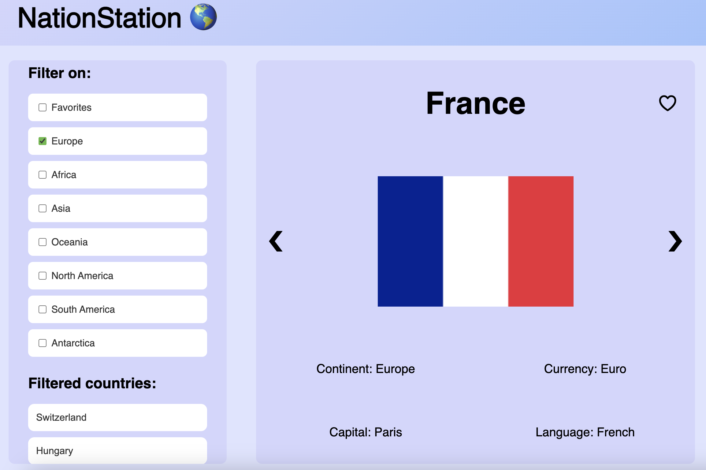
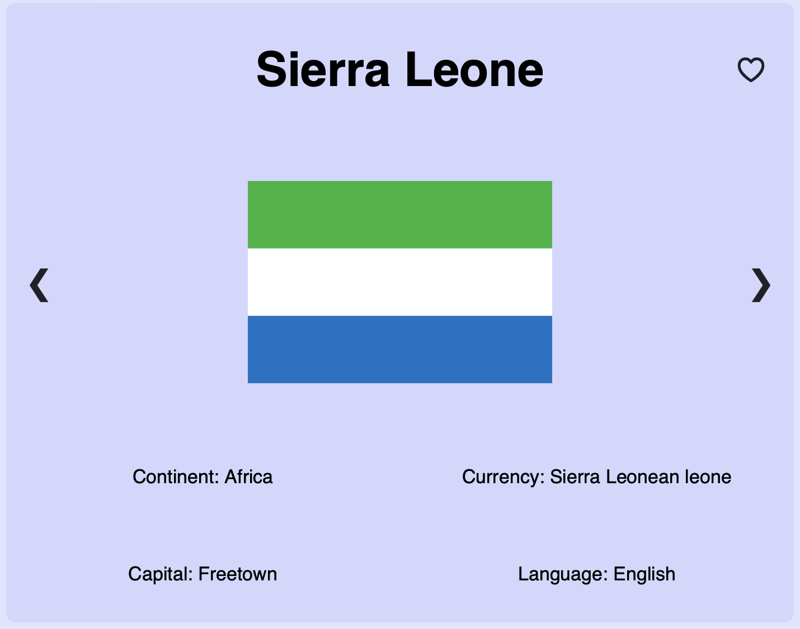
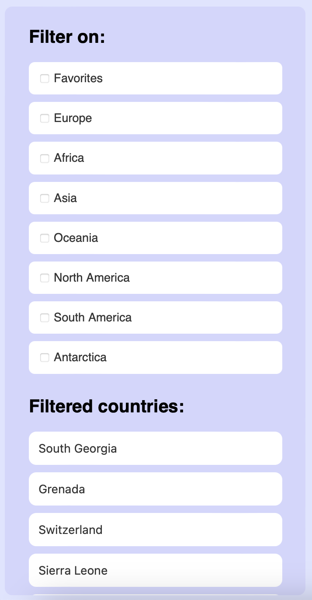

# NationStation 🌍

## 🌍 Short description

NationStation is a dynamic and responsive application created in connection with the NTNU subject IT2810 Webutvikling. The main task was to fetch data from a REST API and present the result to the user in a user-friendly way that fulfills different technical and functional demands given.

In NationStation, we fetch data on 60 different countries from a REST API called [Restcountries](https://restcountries.com). We present the countries one at a time to the user through CountryCards, which display different key facts associated with the given country. A photo from the application looks is displayed below.



## 🌍 More detailed description of the main components

### CountryCard component



The CountryCard component displays one country at a time along with key facts such as the capital, flag, continent, currencies and languages associated with the given country. The user can click himself/herself to the next/previous country using the arrow buttons.

Additionally, the user can mark certain countries as favorites. This will be remembered by the browser (through localStorage), even if the application is exited and restarted.

### FilterOverview Component



In the FilterOverviewComponent, we have a list of filtering options as well as a list of the countries that corresponds to the selected filters. It is possible to filter on continents and favorite countries. When clicking on a country from the list of filtered countries, the CountryCard of that very country will be rendered.

The selected FilterOptions will be remebered if the page is refreshed (through sessionStorage).

## 🌍 Technologies

This project uses [Vite](https://vitejs.dev) as the build tool and [React](https://react.dev) as the frontend framework with [TypeScript](https://www.typescriptlang.org) for type safety.

For responsive design we have used CSS Grid, CSS Flexbox, media queries and Viewport CSS Units. With these tools at hand, we have made sure that the components will manage to adjust to different screen sizes.

We have also used [TanStack Query](https://tanstack.com/query/latest) to streamline data fetching, caching, synchronization, and handle loading and error states more efficiently throughout our application.

## 🌍 Installation and running the project

To run the project locally, you need to have Node.js and Npm installed. If you don't have these, you can download them from the following links:

- [Node.js](https://nodejs.org/en/)
- [Npm](https://www.npmjs.com)

We use Node version 22.

When you have Node.js and Yarn installed, you can follow the steps below.

### How to run the project locally

1. Clone the repository
2. Open the terminal and navigate to /T13-Project-1/prosjekt1 directory:
   ```
   cd prosjekt1
   ```
3. Run `npm install` to intall the project dependencies
4. Run `npm run dev` to start the developement server
5. Follow the instructions in the terminal to open the project in your browser (open localhost)

### How to access the project through our virtual machine

The project can found on this link: [Open application with virtual machine](http://it2810-13.idi.ntnu.no/project1/)

## 🌍 Testing

This project uses [Vitest](https://vitest.dev) for testing. In order to familiarize with React testing, we have written rendering tests with snapshots, state tests and userEvent tests in order to test different aspects of our application. We also use a mockserver, so that the tests do not fetch actual data.

### How to run the tests

1. If you are not already in the prosjekt1 folder, navigate into it with the command: `cd prosjekt1`
2. Run `npm test`

## 🌍 Other comments about the application

### #1: Warning when running tests

When running the tests, the user will get warnings about deprecation of the 'punycode' module. After a lot of troubleshooting and conversations with student assistants, we believe this warning cannot be fixed within our code. Therefore, we choose to ignore it for now.

### #2: Responsive design exception

We have tested that the application works well on both the laptops, iPads and mobile devices we have at hand. However, we noticed that the design breaks when tilting mobile devices horizontally. This is very strange, because in the browser inspect window, when simulating a tilted mobile device, the application does **not** break.

We are not sure why this is happening, and it has been difficult to test because it requires us to update the project version on the virtual machine every time we want to check how it "actually" looks. We have not had enough time to solve this now, but it is something we will look into before the next evaluation of the project.

## 🌍 Authors

This project is authored by Group 13 in IT2810 Webutvikling.
